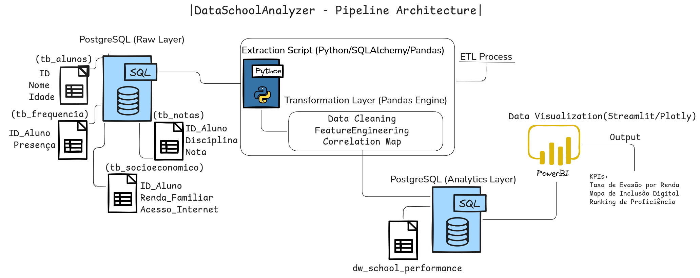

# 📊 DataSchoolAnalyzer: Pipeline de Engenharia de Dados

Este projeto foi desenvolvido como **Atividade Extensionista I** para o curso de Ciência da Computação. O objetivo é monitorar a qualidade educacional e identificar disparidades de inclusão digital através de um pipeline de dados automatizado.

## 🏗️ Estrutura do Projeto
- **Ingestão:** `popular_banco.py` (Cria e popula o banco de dados).
- **Processamento (ETL):** `analise_escola.py` (Transforma dados brutos em indicadores).
- **Visualização:** `dashboard.py` (Painel interativo em Streamlit).

---

## 🛠️ Pré-requisitos
1. **PostgreSQL** instalado e rodando.
2. Acesso ao banco com as credenciais configuradas nos scripts.
3. Criar o banco de dados manualmente uma única vez:
   ```sql
   CREATE DATABASE db_escola;
   ```

🚀 Como Executar
Opção A: Execução Automática (Recomendado)

Se você já tem o Python e o PostgreSQL configurados, basta rodar o script de setup correspondente ao seu sistema:

    Linux (Fedora/Debian/Ubuntu/Mint):
    Bash

    chmod +x setup_linux.sh
    ./setup_linux.sh

    Windows: Execute o arquivo setup_windows.bat com um clique duplo.

Opção B: Execução Manual (Passo a Passo)

    Instalar Dependências:
    Bash

    pip install -r requirements.txt

    Popular o Banco de Dados:
    Bash

    python scripts/popular_banco.py

    Executar o Pipeline de Análise (ETL):
    Bash

    python scripts/analise_escola.py

    Iniciar o Dashboard:
    Bash

    streamlit run scripts/dashboard.py

📈 Tecnologias Utilizadas

    Linguagem: Python 3.14

    Banco de Dados: PostgreSQL

    Bibliotecas: Pandas, SQLAlchemy, Plotly, Streamlit.

---

## 🏗️ Data Architecture
Abaixo está a representação da arquitetura do pipeline, desde a ingestão dos dados brutos e ETL até a camada de análise.



---

## 📊 DataSchoolAnalyzer Execution
Confira abaixo a demonstração do dashboard interativo e os filtros em funcionamento:

[[video:video]]assets/DataSchoolAnalyzer.mp4